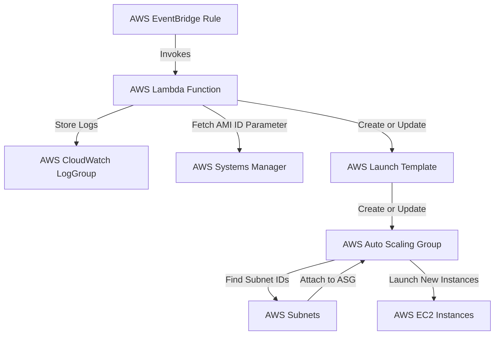
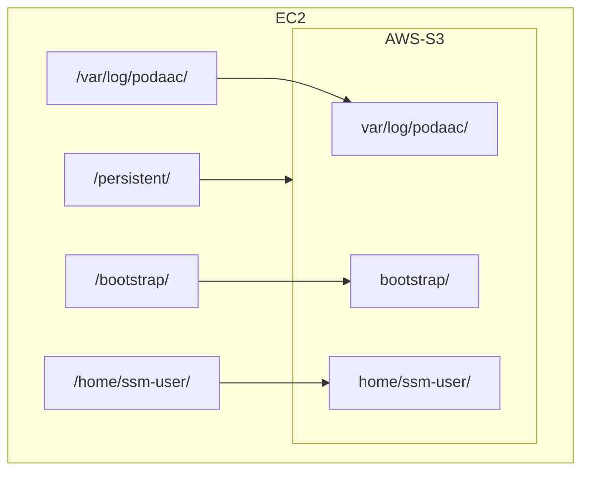

# cloud-infra-base
aka Carpathia

## Package Lambda
```bash
zip carpathia_lambda_function.zip carpathia_lambda_function.py
```

## Terraform Commands

### Init
```bash
terraform init
```

### Plan with a .tfvar file
```bash
terraform plan -var-file="envs/sandbox.tfvars"
```

### Invoke Lambda Function
```bash
aws lambda invoke --function-name LAMBDA_FUNCTION response.json
```

## Architecture


## S3 to EC2
